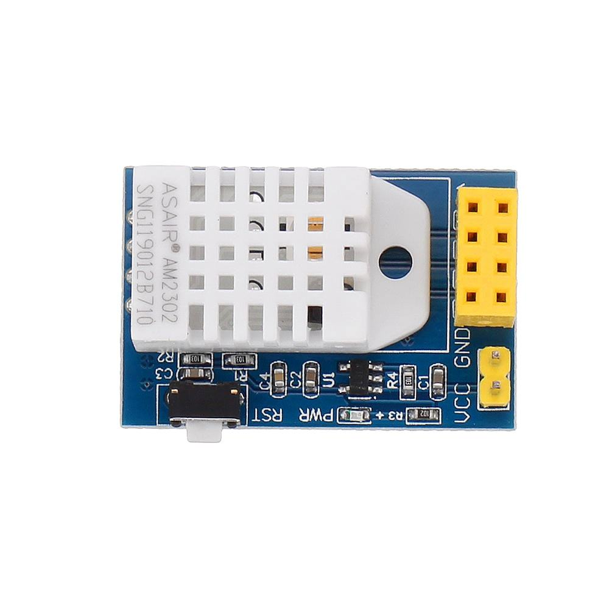

# ESP-01S DHT22 MQTT sensor

Arduino firmware for an ESP-01S on the blue ESP-01S/DHT22 sensor board. It
publishes temperature and relative humidity to MQTT at startup, after a
reconnection, and every five minutes while running.



See the [Aideepen product page](https://www.aideepen.com/products/esp-01s-esp-01-dht22-temperature-humidity-sensor-wifi-module)
for the reference board.

## Prerequisites

- An ESP-01S with **1 MB flash**. The PlatformIO board profile is `esp01_1m`;
  check the flash size of other ESP-01S variants before uploading.
- An ESP-01S/DHT22 (AM2302) board with a 5 V `VCC` input, `GND`, and an
  on-board 3.3 V regulator. The DHT22 data line on the reference board uses
  ESP GPIO2.
- A compatible USB ESP-01S programmer. The CH340 programmer used for this
  project works with `upload_resetmethod = nodemcu`.
- [PlatformIO Core](https://docs.platformio.org/en/latest/core/installation/index.html)
  and a 2.4 GHz Wi-Fi network.
- An MQTT broker reachable on a plain TCP port. This firmware does **not**
  implement TLS; MQTT credentials are transmitted without transport
  encryption. Use it only on a network where that is acceptable.

The ESP-01S itself needs **3.3 V** at its VCC pin. Apply 5 V only to the
sensor board's marked `VCC` input; its regulator powers the ESP socket. Never
connect the USB programmer and the powered sensor board to the ESP at the
same time.

## Getting started

1. Install PlatformIO Core and confirm that `pio --version` works.
2. Copy the configuration template into the ignored local header:

   ```sh
   mkdir -p include
   cp examples/sensor_secrets.example.h include/sensor_secrets.h
   chmod 600 include/sensor_secrets.h
   ```

3. Edit `include/sensor_secrets.h` with your Wi-Fi SSID and password, MQTT
   broker address and port, MQTT username and password, and topic prefix.
   These are C++ string literals: write a quote as `\"` and a backslash as `\\`.
   Set the MQTT username and password to empty strings if the broker is
   anonymous. The build rejects unchanged template credentials.
4. Give this device a unique ID and build it. IDs must be 2–24 lowercase
   characters, start with a letter, end with a letter or digit, and contain
   only letters, digits, and hyphens:

   ```sh
   SENSOR_ID=living-room pio run
   ```

5. With the ESP unpowered, insert it into the USB programmer. Upload the
   firmware, then disconnect the programmer:

   ```sh
   SENSOR_ID=living-room pio run -t upload --upload-port /dev/ttyUSB0
   ```

6. Insert the unpowered ESP into the DHT22 board and power the board through
   `VCC (5 V)` and `GND`. The serial pins are not accessible while the ESP
   is in the sensor board; check the MQTT broker for the first measurement.

For additional devices, keep the same local configuration and repeat the
build/upload commands with a different `SENSOR_ID`. Each ID becomes the Wi-Fi
hostname `esp01-<ID>`, the MQTT client ID, and part of the topic. Two active
devices must not share an ID. For a device on another Wi-Fi network or broker,
set `SENSOR_CONFIG_DIR` to a directory containing another `sensor_secrets.h`.

### Debian serial-port permissions

For persistent access, add your user to `dialout` and sign out and back in:

```sh
sudo usermod -aG dialout "$USER"
```

For temporary access to the currently attached programmer:

```sh
sudo setfacl -m u:"$USER":rw /dev/ttyUSB0
```

This ACL can disappear when the USB programmer is unplugged.

## MQTT messages

The topic is `<mqtt_topic_prefix>/<SENSOR_ID>/state`. With the example
configuration and ID above, it is `home/sensors/living-room/state`.

```json
{"temperature_c": 21.4, "humidity_pct": 48.2}
```

Messages use QoS 1 and the retain flag. A retained value may be older than
the current sensor reading. A fresh reading is published after a successful
MQTT connection and then every minute. Invalid DHT22 readings are
skipped.

## Local files and public repositories

`include/sensor_secrets.h` is ignored by Git. The compiled firmware contains
its credentials, so generated `.bin` and `.elf` files are ignored as well.
Check the ignore rules before publishing:

```sh
git check-ignore -v include/sensor_secrets.h DEVICES.md
```

Keep your device locations and MAC addresses in a local `DEVICES.md`. Copy
[the inventory template](examples/DEVICES.example.md) if needed; that local
file is also ignored by Git. `git add -f` overrides ignore rules, so review
the staged files before pushing a public repository.

## Project layout

- `src/mqtt.cpp`: sensor readings, Wi-Fi reconnection, and MQTT publishing.
- `tools/select_config.py`: validates the device ID and selects the local
  credential header.
- `examples/`: safe templates for local credentials and device inventory.
- `docs/esp01s-dht22-board.png`: photo of the reference sensor board.

## License

This project is available under the [MIT License](LICENSE).
